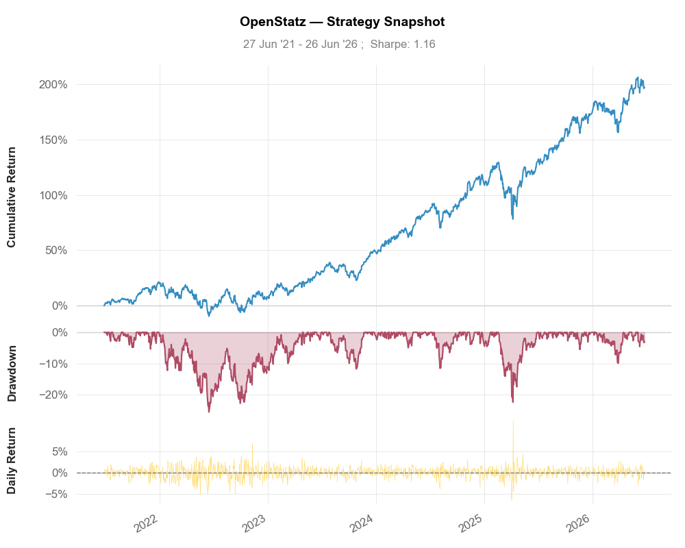

# OpenStatz

> A modern rebuild of [QuantStats](https://github.com/ranaroussi/quantstats): the same trusted
> portfolio analytics, a fast pandas + NumPy core, and an optional modern web tearsheet — with
> **enforced, bit-for-bit output parity** to the original library.



OpenStatz is **library-first**. One codebase, three ways to use it:

| Mode | Install | Usage |
|---|---|---|
| Library (drop-in) | `pip install openstatz` | `import openstatz as os; os.stats.sharpe(r)` |
| Pandas extension | `pip install openstatz` | `os.extend_pandas(); r.sharpe()` |
| Web tearsheet | `pip install "openstatz[app]"` | `openstatz serve` → http://127.0.0.1:8000 |

The web app ships **pre-built inside the package**, so the `serve` command needs **no Node.js** — just Python.

> **Alias note:** the documented alias is `os` (`import openstatz as os`), which shadows Python's
> stdlib `os` inside files that use it — `import os as _os` if you need both. The QuantStats `qs`
> alias also works.

## Send your backtest to OpenStatz

Already have a strategy's returns from a backtest? Feed the pandas Series straight in — exactly
like QuantStats:

```python
import openstatz as os

returns   = my_backtest.returns        # a pd.Series of daily returns
benchmark = os.utils.download_returns("SPY")

os.reports.html(returns, benchmark=benchmark, output="tearsheet.html")  # full HTML tearsheet
os.reports.metrics(returns, mode="full", display=True)                  # printed metrics table
os.extend_pandas(); returns.sharpe()                                    # pandas methods
```

Or send it to the running server and get JSON back (metrics + chart series + tables):

```bash
curl -X POST http://127.0.0.1:8000/api/analyze \
  -H "Content-Type: application/json" \
  -d '{"dates": ["2024-01-02", ...], "returns": {"Strategy": [0.001, ...]}, "benchmark": [0.0008, ...]}'
```

## The web tearsheet

```bash
pip install "openstatz[app]"
openstatz serve            # -> http://127.0.0.1:8000  (UI + API, no Node.js)
```

Two ways in, right from the browser:

- **Symbol** — type a ticker (e.g. `RELIANCE.NS`) + a benchmark (`^NSEI`) and period.
- **Upload CSV** — drop in your backtest's returns: a `date, return[, benchmark]` CSV (values as
  decimals, percents, or prices). See [`docs/example_returns.csv`](docs/example_returns.csv).

You get a sectioned tearsheet — **Overview · Performance · Risk · Monthly · Distribution ·
Metrics** — with:

- **Light & dark themes** (minimalist black-and-white shadcn styling; light by default).
- Gradient-area **cumulative return** (with a thin blue benchmark overlay) and **underwater
  drawdown** charts.
- **Monthly** and year-selectable **weekly** return **heatmaps** (diverging green/red).
- **EOY returns vs benchmark** bar chart, distribution, box plot, rolling Sharpe/vol/beta.
- The full **81-metric** table, P&L color-coding throughout, and **vector PDF export**.

`lightweight-charts` lives behind a single `<TimeSeriesChart>` adapter; the statistical panels are
bespoke SVG for crisp PDF output.

## API

`pip install "openstatz[app]"` adds a FastAPI service (the adapter performs **no math** — it calls
the library and serializes):

- `GET  /api/health` → `{ status, version, numba }`
- `POST /api/analyze` → analysis bundle from raw `{ dates, returns, benchmark? }`
- `POST /api/analyze/symbol` → analysis bundle for a ticker fetched server-side via a provider

`python scripts/export_openapi.py` writes the OpenAPI schema (for TypeScript type generation).

## Data providers

`openstatz.providers` is a small pluggable layer — `yfinance` (default) and an optional `OpenAlgo`
provider:

```python
from openstatz import providers
r = providers.download_returns("SPY", period="5y")                  # yfinance
# providers.register_provider(OpenAlgoProvider(api_key=..., host=...)); ... provider="openalgo"
```

## QuantStats compatibility

OpenStatz is a verified drop-in — **0 missing public symbols** (stats, utils, reports, plots, and
the full `extend_pandas()` method map). To run unmodified QuantStats scripts:

```python
import openstatz.compat; openstatz.compat.install_quantstats_shim()
import quantstats as qs        # this is OpenStatz
```

## Parity is enforced, not promised

`tests/parity/` is a golden-master gate: it snapshots reference QuantStats output on a corpus
(single/multi-strategy, with/without benchmark, compounded/simple, daily/monthly) and asserts
OpenStatz reproduces every metric to `rtol=1e-9`, every table, and every chart's source series.
Verified bit-for-bit (0.00 difference) including on live market data.

```bash
python tests/parity/generate_fixtures.py   # re-baseline from a reference quantstats checkout
pytest tests/parity -q                      # the gate (needs only openstatz + committed fixtures)
```

`QUANTSTATS_SRC` overrides the reference checkout path (default `D:/testing/quantstats`).

## Performance

Compute stays on **pandas** for free parity, with vectorized **NumPy** kernels accelerating a few
loop-shaped hot spots (e.g. ~11× on the Monte Carlo per-column max-drawdown), each gated by a
parity test. Numba is intentionally deferred — it creates NumPy-compatibility friction; the pure
path is the default and the library installs everywhere.

## Layout

```
openstatz/            the library (drop-in for quantstats)
  app/                optional FastAPI adapter + serializers ([app] extra) — no math
  app/static/         the pre-built web UI shipped in the wheel (no Node at runtime)
app/                  web UI source (Vite + React + TS + Tailwind/shadcn)
tests/parity/         golden-master parity gate
scripts/              OpenAPI export, etc.
```

## Development

```bash
uv pip install -e ".[dev,app]"
pytest tests -q                       # unit + parity + API

# Web UI (contributors only — needs Node). Dev server proxies /api to :8000:
cd app && npm ci && npm run dev       # http://localhost:5173

# Rebuild the shipped bundle:
cd app && npm run build && cp -r dist/* ../openstatz/app/static/
```

## License

**Apache-2.0** — see [`LICENSE.txt`](./LICENSE.txt) and [`NOTICE`](./NOTICE). The portfolio-analytics
implementation is reused verbatim from QuantStats (© 2019–2025 Ran Aroussi, Apache-2.0); OpenStatz
additions © 2026 contributors. See [`2026-rebuild-architecture.md`](./2026-rebuild-architecture.md)
for the full design and roadmap.
